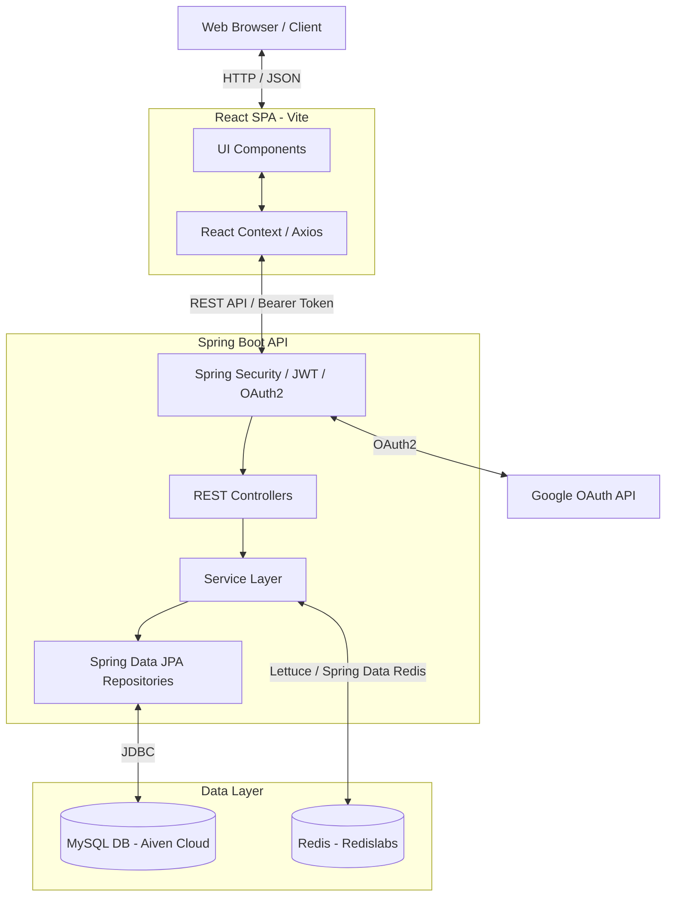
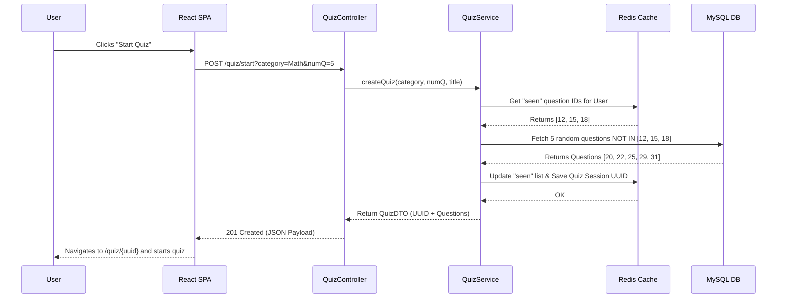
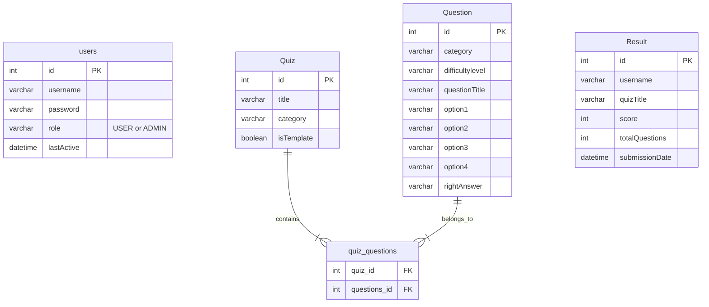
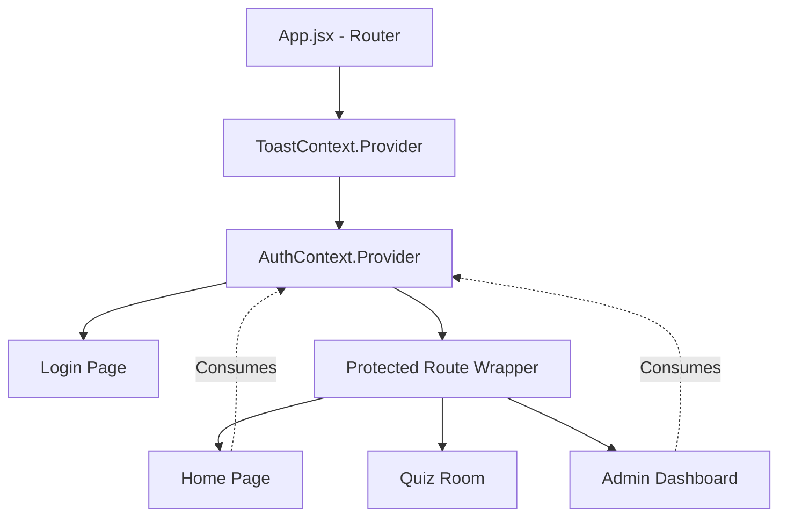
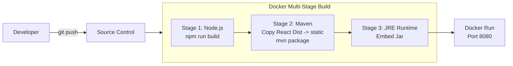

# BrainBlast - Think Fast. Learn Faster. Win Every Quiz.🚀

> A full-stack, dynamic, and highly scalable Quiz Application for conducting continuous learning and assessment tests.

[](#)
[](#)
[](#)
[](#)
[](#)

BrainBlast is a robust full-stack platform designed to create, manage, and take interactive quizzes. It solves the problem of repetitive assessment by utilizing a stateless Redis-backed session architecture for dynamic endless quiz modes, alongside robust relational mapping for administrative quiz management and score tracking.

### Key Features
- **Dynamic & Endless Quizzes**: Take curated template quizzes or let the system generate infinite unique questions via Redis session tracking to avoid repetition.
- **Role-Based Access Control**: Secure `ADMIN` dashboard for CRUD question/quiz management and a sleek `USER` interface for seamless test-taking.
- **Secure Authentication**: Built-in OAuth2 (Google Login) and traditional JWT-based credential authentication.
- **Stateless Session Tracking**: Leverages Redis for tracking seen questions and active quiz sessions without bloating the primary MySQL database.
- **Premium UI/UX**: Highly responsive and dynamic user interface built with React, Vite, Tailwind CSS, and Framer Motion.

---

## 2. Architecture Overview

The system is built on a modern decoupled architecture. The frontend is a Single Page Application (SPA) built with React that communicates with a Spring Boot RESTful API backend. The backend persists relational data (Users, Questions, Results) in a managed MySQL database (Aiven Cloud), while utilizing Redis for high-speed, ephemeral session tracking (e.g., tracking which questions a user has already answered in "Endless Mode").



**Why this decision?**
Redis was chosen for tracking "seen" questions during dynamic quiz sessions because updating relational tables for every single question answered by every user would cause severe write-contention and bloat. Redis handles these rapid, ephemeral read/writes efficiently.

---

## 3. Tech Stack

| Layer | Technology | Purpose |
| --- | --- | --- |
| **Frontend** | React 19, Vite | Core SPA framework and rapid build tool. |
| **Frontend Styling** | Tailwind CSS, Framer Motion | Utility-first styling and micro-animations for premium UX. |
| **Backend Core** | Java 17, Spring Boot 3.5.10 | Robust REST API server and dependency injection framework. |
| **Security** | Spring Security, JWT, OAuth2 | Authentication, authorization, and stateless session verification. |
| **Database (SQL)** | MySQL (Aiven Cloud), Hibernate | Primary data persistence (Users, Questions, Quizzes, Results). |
| **Database (NoSQL)** | Redis (Redislabs) | Tracking ephemeral quiz sessions and "seen" question IDs. |
| **DevOps** | Docker, Maven, npm | Multi-stage containerization for seamless unified deployment. |

---

## 4. Project Structure

```text
QuizApplication/
├── Spring-Boot/             # Spring Boot Backend Codebase
│   ├── src/main/java/com/icemberg/QuizApplication/
│   │   ├── config/              # Security, CORS, OAuth2, and Redis configurations
│   │   ├── controller/          # REST API Endpoints (Auth, Question, Quiz)
│   │   ├── dto/                 # Data Transfer Objects (AuthRequest, QuestionWrapper)
│   │   ├── entity/              # JPA Hibernate Entities (User, Question, Quiz, Result)
│   │   ├── repository/          # Spring Data JPA Interfaces
│   │   └── service/             # Business Logic (Quiz generation, Redis interactions)
│   └── src/main/resources/      # application.properties (Environment Configs)
│
├── React/                # React Frontend Codebase
│   ├── src/
│   │   ├── api/                 # Axios interceptors for JWT injection & error handling
│   │   ├── components/          # Reusable UI components (ProtectedRoute, OAuthHandler)
│   │   ├── context/             # React Context for global state (AuthContext, ToastContext)
│   │   └── pages/               # Route components (Login, Home, QuizRoom, Admin Dashboard)
│   └── package.json             # Frontend dependencies
│
├── Dockerfile                   # Multi-stage build combining Frontend and Backend
└── quizapplication_data.sql     # Database dump for initial setup / migration
```

---

## 5. Data Flow Diagram

The following sequence diagram illustrates the data flow when a user requests to start a new dynamic quiz.



---

## 6. Database Schema

The relational schema relies on a mapping between Quizzes and Questions, alongside an independent tracking mechanism for Results.



---

## 7. API Reference

| Method | Endpoint | Description | Auth Required |
| --- | --- | --- | --- |
| `POST` | `/auth/register` | Register a new user | No |
| `POST` | `/auth/login` | Authenticate and retrieve JWT token | No |
| `GET` | `/quiz/allQuizzes` | Retrieve all public template quizzes | No |
| `POST` | `/quiz/start` | Start a dynamic session for a specific category | Yes (USER) |
| `GET` | `/quiz/getQuizQuestions/{id}` | Fetch questions for a specific Quiz ID/UUID | Yes (USER) |
| `POST` | `/quiz/submitQuiz/{id}` | Submit answers and calculate score | Yes (USER) |
| `GET` | `/question/allQuestions` | Fetch all questions in the system | Yes (ADMIN) |
| `POST` | `/question/addQuestion` | Create a new question | Yes (ADMIN) |

**Example: `POST /auth/login`**
```json
// Request
{
  "username": "user123",
  "password": "password"
}

// Response (200 OK)
{
  "token": "eyJhbGciOiJIUzI1NiJ9...",
  "role": "USER",
  "username": "user123"
}
```

---

## 8. State Management (Frontend)

State is primarily managed via React's Context API to prevent prop-drilling for global authentication and UI alerts. Local component state is used for individual forms and active quizzes.



**Why this decision?**
Since the global state is relatively simple (just user tokens, roles, and toast notifications), relying on Context API removes the need for heavier external libraries like Redux, keeping the bundle size small and the architecture simple.

---

## 9. CI/CD Pipeline

The deployment process is heavily streamlined using Docker multi-stage builds.



---

## 10. Getting Started

### Prerequisites
- Java 17
- Node.js (v20+)
- Maven (v3.9+)
- MySQL Server
- Redis Server (or Cloud Redis)

### Local Setup

1. **Clone the repository:**
   ```bash
   git clone https://github.com/yourusername/QuizApplication.git
   cd QuizApplication
   ```

2. **Database Setup:**
   Create a MySQL database and import the seed data.
   ```bash
   mysql -u root -p quizapplication < quizapplication_data.sql
   ```

3. **Backend Environment Variables (`application.properties`):**
   Navigate to `Spring-Boot/src/main/resources/application.properties` and configure:
   
   | Variable | Description | Default |
   | --- | --- | --- |
   | `spring.datasource.url` | MySQL DB URL | `jdbc:mysql://localhost:3306/quizapplication` |
   | `spring.datasource.username` | MySQL Username | `root` |
   | `spring.datasource.password` | MySQL Password | `your_password` |
   | `spring.data.redis.host` | Redis Host | `localhost` (or cloud url) |
   | `spring.security.oauth2.*` | Google OAuth2 Credentials | (Required for Google Login) |

4. **Run Backend:**
   ```bash
   cd Spring-Boot
   mvn spring-boot:run
   ```

5. **Run Frontend:**
   ```bash
   cd ../React
   npm install
   npm run dev
   ```

**Common Setup Errors:**
- *CORS Errors*: Ensure the Vite development server is running on a port permitted by `CorsConfig.java` in the backend.
- *Redis Timeout*: If using a cloud Redis instance, verify that your network/firewall allows outbound traffic on the Redis port (e.g. `15204`).

---

## 11. Testing

The backend relies on Spring Boot Test for integration and unit testing.

To run the backend test suite:
```bash
cd Spring-Boot
mvn test
```
*(Currently configured tests cover repository interactions, context loads, and controller mappings.)*

---

## 12. Contributing

We welcome contributions to QuizApplication! Please adhere to the following standards:

- **Branch Naming:** Use `feature/<feature-name>`, `bugfix/<bug-name>`, or `hotfix/<issue>`.
- **Commit Messages:** Follow [Conventional Commits](https://www.conventionalcommits.org/en/v1.0.0/).
  - Example: `feat(quiz): add timer to quiz room`
  - Example: `fix(auth): resolve redirect loop in OAuth handler`
- **PR Checklist:**
  - [ ] Code compiles and `mvn test` passes.
  - [ ] New endpoints are documented in the README.
  - [ ] No hardcoded credentials are included.

---

## 13. License & Credits

This project is licensed under the MIT License. 

*Developed and maintained by the QuizApplication team.*
